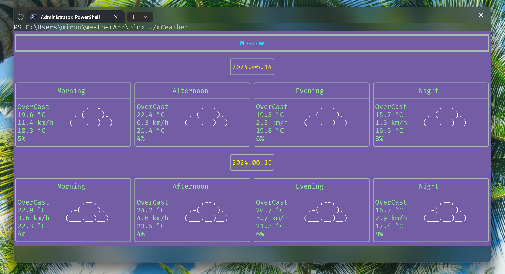

# A console application that displays the weather forecast for a selected list of cities

 
*This app was made as a lab in a c++ course at my university*

## Application Features
 - Display the weather forecast for several days ahead (the default value is set by the config)
-  Update with some frequency (set by the config)
 - Switch between cities using the "h", "l" keys (set in the config)
 - End the program using Esc
 - Increase/decrease the number of forecast days by pressing the "k", "j" keys

## Installation
### 1. Building from source
#### 1. Make sure you have the following dependencies: *cmake, ninja, git, gcc, g++*

#### 2. Open the terminal and enter the commands below
```
git clone https://github.com/miroshQa/ConsoleWeatherApp.git   
cd ConsoleWeatherApp  
mkdir build
cd build
cmake -G "Ninja" ..
ninja
cd ..
```

## How to use
1. Copy config from cloned repo to the home directory
```shell
cp ./mwConfig.json ~/mwConfig.json
```
2. Launch the app
```shell
cd bin
./mWeather
```

